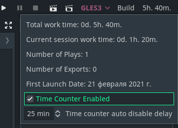

# Work Time Counter for Godot

A simple time counter. It can also count Runs in the editor and the number of exports to target platforms.
I made it for personal use.

## Usage

1. Copy `addons/WorkTimer` to your project `addons/WorkTimer`.
1. Optional for Discord support. If you don't need it just uncomment first line (`#define NO_DISCORD`) in `addons/WorkTimer/WorkTimer.cs`.
    1. Download [Discord Game SDK](https://discord.com/developers/docs/game-sdk/sdk-starter-guide#step-1-get-the-thing) and extract `csharp` and `lib` folder into `addons/WorkTimer/discord_sdk`
    1. Change the path to the discord libraries in `addons/WorkTimer/discord_sdk/csharp/Constants.cs` to `addons/WorkTimer/discord_sdk/lib/x86_64/discord_game_sdk`

